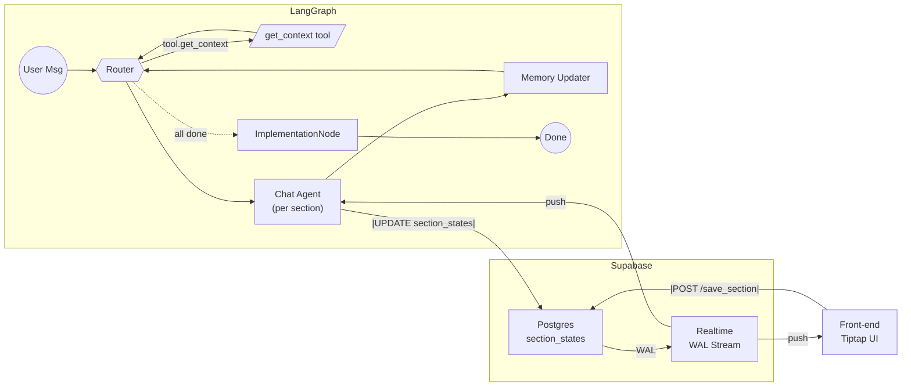

# Design Doc

# Value-Canvas LangGraph MVP · Design Doc

---

## 0. 文档关系说明

**本设计文档与 AI Agent [Value Canvas]-prompts-and-instructions.pdf 的关系：**

- **PDF文档** = **Agent行为规范**（WHAT）：定义Value Canvas AI Agent应该如何与用户交互，包含系统prompt、引导技术、所有权建立方法等高层次的行为要求
- **本设计文档** = **技术实现架构**（HOW）：描述如何使用LangGraph多节点架构来实现PDF中定义的复杂Agent行为

**架构设计理念：**
- PDF中描述的是一个完整的Value Canvas咨询流程，需要复杂的对话引导、状态管理、回退机制
- 传统的单一LLM调用无法有效处理如此复杂的多阶段交互和状态管理
- 因此采用LangGraph的多节点架构：
  - **Router**: 管理section切换和流程控制
  - **Chat Agent**: 专注于基于PDF规范的对话引导，无工具干扰
  - **Memory Updater**: 处理数据持久化和状态更新
  - **Implementation**: 生成最终deliverable

**关键设计决策：**
- Chat Agent不使用工具，专注于实现PDF中要求的复杂对话引导和所有权建立技术
- 通过Router实现PDF中要求的section间导航和回退逻辑
- 通过结构化的section_states管理PDF中描述的复杂数据收集流程

---

---

---

# Value-Canvas LangGraph MVP · Design Doc

---

## 1. Goals & Scope

| Dimension | Content |
| --- | --- |
| **Business Goal** | Guide the user to complete the Value Canvas section by section; support modification at any time and resume from breakpoints; automatically export Checklist/PDF once all sections are completed. |
| **MVP Constraints** | Single user • Rich text uses **Tiptap JSON** • Real-time collaboration fully relies on **Supabase Realtime** • Score < 3 triggers fallback. |
| **Completion Criteria** | All test cases **TC-01 ~ TC-10** pass; recoverable after refresh; AI and user can see each other's changes in Tiptap in real time. |

---

## 2. Overall Architecture

**Core Concept:**



---

## 3. Component Responsibilities (Detailed Breakdown)

| Component | Input (from…) | Output / Impact | Responsibilities & Internal Logic |
| --- | --- | --- | --- |
| **Router** | `state.router_directive` ← Chat Agent `state.section_states` ← MemoryUpdater | ① Update `state.current_section` ② Call **get_context** ③ If no unfinished section → set `state.finished=true` | ▸ **Decision Flow**  • `stay` → stay in current section, **do not** call get_context.  • `next` → `next_unfinished()` finds next section ID.  • `modify:X` → jump directly to section with id X. ▸ **get_context Call** fetches all necessary data from DB, including section-related prompts and raw data, then assembles and writes full data into `state.context_packet`. ▸ **Completion Check** • If `next_unfinished()` returns None → `finished=True` and call ImplementationNode to generate final PDF. ▸ **Error Handling** • If get_context times out → retry 3 times, then fallback to same section and prompt user. |
| **Chat Agent** | `state.context_packet` (with system_prompt & draft) `state.short_memory` ← MemoryUpdater `state.user_input` ← User | • `agent_reply` to user • `section_update`, `score`, `router_directive` → MemoryUpdater | ▸ **Assemble messages** `[{role:"system",content:system_prompt}, *short_memory, {role:"user",content:user_input}]` ▸ **Validate Input**: call `validate_field`; invalid input → reply with error, force `router_directive = "stay"` ▸ **Generate Draft**: construct *Tiptap JSON* in memory and write into `section_update.content` ▸ **Scoring & Flow Control** • Ask user for score; if `score<3` output `router_directive:"stay"`. • If `score≥3` and user agrees → `router_directive:"next"`. • Natural language like “edit Pain-2” → `router_directive:"modify:Pain-2"`. ▸ **Output fixed JSON** (see schema), no direct DB write; actual DB write handled by MemoryUpdater. |
| **MemoryUpdater** | `section_update, score` ← Chat Agent | ① Update DB ② Update `state.section_states` & `context_packet.draft` ③ Trim `short_memory` | ▸ `UPDATE section_states SET content=$1, score=$2, status='done'` ▸ Write latest draft into `state.context_packet.draft` for immediate reuse when staying. ▸ Keep `short_memory` for last N rounds or ≤8000 tokens. |
| **get_context api** | `section_id, user_id, doc_id, status` ← Router | `context_packet` → Router | ▸ **Fetch data** `SELECT content, score, status FROM section_states WHERE …` ▸ **Generate prompt** `system_prompt = BASE_RULES + "\n---\n" + SECTION_TEMPLATE[section_id].render(draft)` ▸ **Return** `json<br>{ "section_id":…, "status":…, "system_prompt":…, "draft": {...} }` (example) |
| **Supabase Realtime** | Postgres WAL | JS payload broadcast | ▸ Listen condition: `doc_id = eq.<currentDoc>` (UPDATE/INSERT). ▸ Push: `json { "type":"row_update", "new":{section_id, content,...} }` |
| **Front-end (Tiptap UI)** | Realtime event | `editor.setContent()` • `POST /save_section` | ▸ **Subscribe** Realtime channel `vc:<doc_id>`. ▸ **Render** `editor.commands.setContent(payload.new.content, false)`. ▸ **User Action**: click **Save** → call `/save_section` (UPDATE same table). |
| **ImplementationNode** | `section_states` (all done) | PDF/HTML Checklist URL | ▸ Aggregate all SectionState.content. ▸ Generate Markdown → PDF via template. ▸ Store in S3 / Supabase Storage, return download link. |

---

### Key Contracts Between Components

1. **Single DB Write Path**
    - Supabase Realtime guarantees consistent broadcast of row changes; frontend and Graph sync view.
2. **Router Call Threshold**
    - **Only** call `get_context` on section switch (`next` / `modify`); `stay` skips DB.
3. **Draft Refresh**
    - Graph side listens to same Realtime channel: when user saves → immediately overwrite `state.context_packet.draft`, no re-entry needed.

---

*With this, “Component Responsibilities” now cover input / output / internal logic / error handling dimensions, ready to paste into Notion.*

---

## 4. Data Model

### 4.1 Runtime State (Key Fields)

```json
{
  "user_id": "u123",
  "doc_id": "d456",
  "current_section": "Pain-2",
  "context_packet": {
    "section_id": "Pain-2",
    "status": "pending",
    "system_prompt": "...",
    "draft": {/* Tiptap JSON */}
  },
  "short_memory": [...],
  "router_directive": "stay",
  "finished": false
}

```

### 4.2 Postgres `section_states`

| Column | Type | Description |
| --- | --- | --- |
| id | uuid | PK |
| user_id | uuid | Partition key |
| doc_id | uuid | ↕ |
| section_id | text | “Pain-2” |
| content | jsonb | **Tiptap JSON** |
| score | int | 0-5 |
| status | text | pending/done/modify/generated |
| updated_at | timestamptz | Optimistic lock |

---

## 5. Tool APIs

| Name | Direction | Description |
| --- | --- | --- |
| `get_context` | Router → tool | Assemble `system_prompt + draft` |
| `save_section` (REST) | Front-end → API | Same, for user Save button |
| `validate_field` | Chat Agent → tool | Hard check for length/format |
| `export_checklist` | ImplementationNode → tool | Generate PDF and return URL |

---

## 6. Chat Agent Conventions (Brief)

```
• When generating or modifying draft → only include in this round’s JSON:
  "section_update": { "content": <Tiptap JSON> }
  ——do not call any DB write tool.

• Example of full JSON output:
  {
    "reply": "......",
    "router_directive": "stay | next | modify:<id>",
    "score": 0-5,
    "section_update": { "content": <same Tiptap JSON> }
  }

• score < 3 → router_directive = "stay" (stay in current section).
  score ≥ 3 and user confirms → router_directive = "next".
  Natural language “edit Pain-2” → router_directive = "modify:Pain-2".

• NEVER output HTML / Markdown as draft content; drafts must be valid Tiptap JSON.

(Draft, score, status are all persisted by **Memory Updater** in the next node via single UPSERT.)

```

---

### Graph Side (Python Example)

---

## 7. Test Cases (Manual Testing Later)

| TC# | Scenario & Purpose | Precondition | Steps (Manual) | Expected Result / Assertion |
| --- | --- | --- | --- | --- |
| **TC-01** | **Happy Path – Complete all 9 Sections in one go** | New session, DB empty | Sequentially answer ICP→Pain→Payoffs→Method→Mistakes→Prize→Implementation, all scores **4** | Each section leads to the next; all fields persisted; after completion Checklist is generated |
| **TC-02** | **ICP score <3 triggers fallback** | Enter *ICP Summary* | Input score **2** → choose “Demographics” → edit → rescore **4** | System returns Demographics edit UI → after edit shows Summary → proceeds to Pain |
| **TC-03** | **Pain score <3 triggers fallback** | *Pain 1 Ownership Check* page | Score **1** → choose “Struggle” → edit → score **4** | Router pulls context back to Struggle → after edit regenerate Pain 1 → Summary continues |
| **TC-04** | **Payoff score <3 triggers fallback** | *Payoff 1 Ownership Check* | Score **0** → choose “Objective” → edit → score **4** | Rebuild Payoff 1 and return Summary; flow continues |
| **TC-05** | **Signature Method score <3 triggers fallback** | *Method Summary* | Score **2** → choose “Principle Sequence” → adjust order → score **5** | `sequenced_principles` updated; jump to Prize |
| **TC-06** | **Mistakes score <3 triggers fallback** | *Mistakes Summary* | Score **1** → choose “Mistake 1” → edit → score **4** | Mistake 1 rewritten, Summary updated → continue |
| **TC-07** | **Cross-section quick backtrack** | Already in *Mistakes Summary* | Natural language: “Edit symptom of Pain 2” | Router detects request → open Pain 2 Symptom UI → after edit return to Mistakes Summary |
| **TC-08** | **Resume after disconnect / refresh** | Any section incomplete | Refresh browser or reconnect | Session auto-restores; Assembler replays context; “Welcome back” and resume at previous section |
| **TC-09** | **Invalid input validation** | *Pain 1 Symptom* prompt | Submit empty / 300-char sentence | Agent replies with format warning, stays in current field; nothing persisted |
| **TC-10** | **Implementation checklist visibility** | Finish Prize and click “Yes, show me” | After click, view integrated screen | Full Value Canvas summary + Implementation Checklist displayed (market validation, asset audit, quarterly review etc. |

---