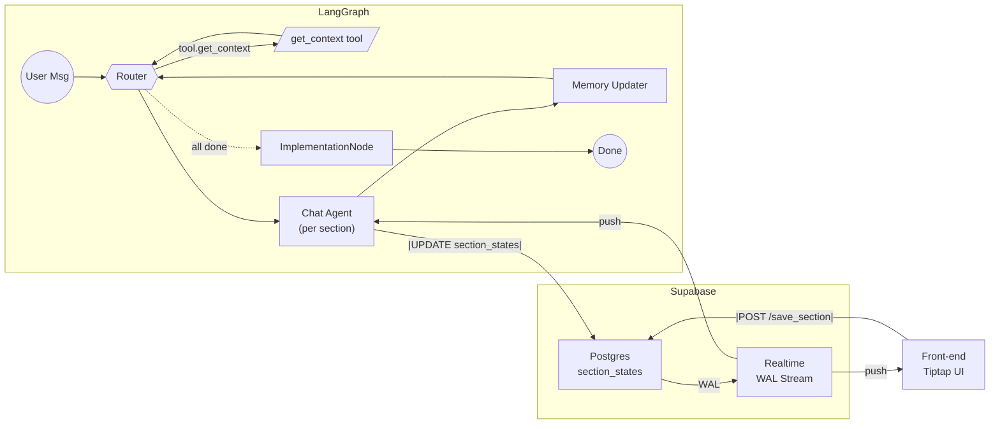

# Design Doc

# Value-Canvas LangGraph MVP · Design Doc

---

## 0. 文档关系说明

**本设计文档与 AI Agent [Value Canvas]-prompts-and-instructions.pdf 的关系：**

- **PDF文档** = **Agent行为规范**（WHAT）：定义Value Canvas AI Agent应该如何与用户交互，包含系统prompt、引导技术、所有权建立方法等高层次的行为要求
- **本设计文档** = **技术实现架构**（HOW）：描述如何使用LangGraph多节点架构来实现PDF中定义的复杂Agent行为

**架构设计理念：**
- PDF中描述的是一个完整的Value Canvas咨询流程，需要复杂的对话引导、状态管理、回退机制
- 传统的单一LLM调用无法有效处理如此复杂的多阶段交互和状态管理
- 因此采用LangGraph的多节点架构：
  - **Router**: 管理section切换和流程控制
  - **Chat Agent**: 专注于基于PDF规范的对话引导，无工具干扰
  - **Memory Updater**: 处理数据持久化和状态更新
  - **Implementation**: 生成最终deliverable

**关键设计决策：**
- Chat Agent不使用工具，专注于实现PDF中要求的复杂对话引导和所有权建立技术
- 通过Router实现PDF中要求的section间导航和回退逻辑
- 通过结构化的section_states管理PDF中描述的复杂数据收集流程

---

## 1. 目标与范围

| 维度 | 内容 |
| --- | --- |
| **业务目标** | 引导用户逐节完成 Value Canvas；支持随时修改、断点续传；全部完成后自动导出 Checklist／PDF。 |
| **MVP 约束** | 单用户 • 富文本采用 **Tiptap JSON** • 实时协同完全依赖 **Supabase Realtime** • 评分 < 3 触发回退。 |
| **完成判定** | 测试用例 **TC-01 ~ TC-10** 全通过；刷新后可恢复；AI 与用户可实时看到对方在 Tiptap 中的改动。 |

---

## 2. 总体架构

**核心理念：**



---

## 3. 组件职责（加详细拆解）

| 组件 | 输入 (来自…) | 输出 / 影响 | 详细职责与内部逻辑 |
| --- | --- | --- | --- |
| **Router** | `state.router_directive` ← Chat Agent`state.section_states` ← MemoryUpdater | ① 更新 `state.current_section`② 调用 **get_context**③ 当无未完成节 → 写 `state.finished=true` | ▸ **决策流**  • `stay` → 保持当前节，**不**再调用 get_context。  • `next` → `next_unfinished()` 找下一个section的 ID。  • `modify:X` → 直接跳section with id X。▸ **get_context 调用** api 从数据库获取context需要的所有数据，包括section 相关的prompt，各种section raw data等等 ，将返回的数据功过拼装全量写入 `state.context_packet`。▸ **完成状态检测**  • 若 `next_unfinished()` 为 None → `finished=True` 并调用 ImplementationNode 来生成最后的pd。▸ **错误处理**  • 如 get_context 超时 → 重试 3 次，失败则回退同节并提示用户。 |
| **Chat Agent** | `state.context_packet` (含 system_prompt & draft)`state.short_memory` ← MemoryUpdater`state.user_input` ← 用户 | • `agent_reply` 给用户• `section_update`, `score`, `router_directive` → MemoryUpdater | ▸ **组装 messages**  `[{role:"system",content:system_prompt}, *short_memory, {role:"user",content:user_input}]`▸ **生成草稿**：在内存构造 *Tiptap JSON* 并写入 `section_update.content`▸ **评分 & 流程控制**  • 询问用户打分；`score<3` 输出 `router_directive:"stay"`。  • `score≥3` 且用户同意 → `router_directive:"next"`。  • 自然语言跳转section“改 Pain-2” → `router_directive:"modify:Pain-2"`。▸ **输出固定 JSON**（见 schema），不直接落库；真正写库由 Memory Updater 统一完成 |
| **MemoryUpdater** | `section_update, score` ← Chat Agent | ① 更新 DB② 更新 `state.section_states` & `context_packet.draft`③ 裁剪 `short_memory` | ▸ `UPDATE section_states SET content=$1, score=$2, status='done'`▸ 把最新草稿写入 `state.context_packet.draft` 以便 stay 情况下即时可用。▸ `short_memory` 保留最近 N 轮或 ≤8000 tokens。 |
| **get_context api** | `section_id, user_id, doc_id, status` ← Router | `context_packet` → Router | ▸ **拉数据** `SELECT content, score, status FROM section_states WHERE …`▸ **生成 prompt**  `system_prompt = BASE_RULES + "\n---\n" + SECTION_TEMPLATE[section_id].render(draft)`▸ **返回**  `json<br>{ "section_id":…, "status":…, "system_prompt":…, "draft": {...} }`  （代码仅示例） |
| **Supabase Realtime** | Postgres WAL | JS payload broadcast | ▸ 监听条件：`doc_id = eq.<currentDoc>` (UPDATE/INSERT).▸ 推送:  `json { "type":"row_update", "new":{section_id, content,...} }` |
| **Front-end (Tiptap UI)** | Realtime 事件 | `editor.setContent()`、`POST /save_section` | ▸ **订阅** Realtime channel `vc:<doc_id>`。▸ **渲染** `editor.commands.setContent(payload.new.content, false)`。▸ **用户操作**：点击 **保存** 调 `/save_section`（UPDATE 同表）。 |
| **ImplementationNode** | `section_states` (全 done) | PDF/HTML Checklist URL | ▸ 聚合所有 SectionState.content.▸ 调模板生成 Markdown → 转 PDF。▸ 存入 S3 / Supabase Storage，返回下载链接。 |

---

### 组件之间的契约关键点

1. **唯一写库路径**
    - Supabase Realtime 保证行变更事件一致广播，前端与 Graph 同步视图。
2. **Router 的调用门槛**
    - **只有**在节切换 (`next` / `modify`) 时调用 `get_context`；`stay` 不调用 DB。
3. **草稿刷新**
    - Graph 侧监听同一 Realtime channel：收到用户保存 → 立即覆盖 `state.context_packet.draft`，无需重进节点。

---

*至此，“组件职责”已补充到输入 / 输出 / 内部逻辑 / 错误处理维度，可直接粘贴进 Notion。*

---

## 4. 数据模型

### 4.1 运行时 State（关键字段）

```json
{
  "user_id": "u123",
  "doc_id": "d456",
  "current_section": "Pain-2",
  "context_packet": {
    "section_id": "Pain-2",
    "status": "pending",
    "system_prompt": "...",
    "draft": {/* Tiptap JSON */}
  },
  "short_memory": [...],
  "router_directive": "stay",
  "finished": false
}

```

### 4.2 Postgres `section_states`

| 列 | 类型 | 说明 |
| --- | --- | --- |
| id | uuid | PK |
| user_id | uuid | ↕ 分区键 |
| doc_id | uuid | ↕ |
| section_id | text | “Pain-2” |
| content | jsonb | **Tiptap JSON** |
| score | int | 0-5 |
| status | text | pending/done/modify/generated |
| updated_at | timestamptz | 乐观锁 |

---

## 5. 工具 API

| 名称 | 方向 | 说明 |
| --- | --- | --- |
| `get_context` | Router → tool | 组装 `system_prompt + draft` |
| `save_section` (REST) | Front-end → API | 同上，供用户保存按钮使用 |
| `validate_field` | Chat Agent → tool | 长度/格式硬校验 |
| `export_checklist` | ImplementationNode → tool | 生成 PDF 并返回 URL |

---

## 6. Chat Agent 约定（简要）

```
• 生成或修改草稿时 → 只需在本轮 JSON 里填入
  "section_update": { "content": <Tiptap JSON> }
  ——不再直接调用任何写库工具。

• 完整 JSON 输出示例：
  {
    "reply": "......",
    "router_directive": "stay | next | modify:<id>",
    "score": 0-5,
    "section_update": { "content": <same Tiptap JSON> }
  }

• score < 3 → router_directive = "stay"（继续留在本节）。
  score ≥ 3 且用户确认 → router_directive = "next"。
  自然语言 “改 Pain-2” → router_directive = "modify:Pain-2"。

• NEVER output HTML / Markdown 作为草稿内容；草稿必须是合法 Tiptap JSON。

（草稿、分数、状态均由 **Memory Updater** 在下一节点一次性 UPSERT 落库。）

```

---

## 7. Supabase Realtime 订阅

### 前端 （JS 示例）

```tsx
import { createClient } from '@supabase/supabase-js'

const supa = createClient(SUPABASE_URL, SUPABASE_KEY)

supa.channel('vc:' + docId)
  .on('postgres_changes', {
       event: 'UPDATE',
       table: 'section_states',
       filter: `doc_id=eq.${docId}`
     },
     payload => {
       if (payload.new.section_id === currentSection) {
         editor.commands.setContent(payload.new.content, false)
       }
     })
  .subscribe()

```

### Graph 侧 (Python示例)

```python
def subscribe_realtime(doc_id):
    ws = SupabaseRealtimeClient(url=URL, key=KEY)

    async def handle(payload):
        if payload["new"]["section_id"] == state["current_section"]:
            state["context_packet"]["draft"] = payload["new"]["content"]

    ws.subscribe(schema="public",
                 table="section_states",
                 event="UPDATE",
                 filter=f"doc_id=eq.{doc_id}",
                 callback=handle)

```

---

---

---

## 8. 测试用例（后续手动测试）

| TC# | 场景&目的 | 前置条件 | 操作步骤（人工执行） | 预期结果 / 断言 |
| --- | --- | --- | --- | --- |
| **TC-01** | **Happy Path – 一口气完成 9 个 Section** | 新建会话，数据库为空 | 依次回答 ICP→Pain→Payoffs→Method→Mistakes→Prize→Implementation，所有评分填 **4** | 每完成一栏即出现下一栏；所有字段写入持久层；流程结束后出现实施指导 Checklist |
| **TC-02** | **ICP 评分<3 触发回退** | 进入 *ICP Summary* | 在评分框输入 **2** → 选择 “人口特征” → 修改 → 再评分 **4** | 系统返回人口特征编辑 UI → 修改后重新显示 Summary → 成功跳转 Pain |
| **TC-03** | **Pain 评分<3 触发回退** | *Pain 1 Ownership Check* 页 | 评分 **1** → 选择 “Struggle” → 修改 → 评分 **4** | Router 把上下文拉回 Struggle → 修改后重生成 Pain 1 → Summary 可继续 |
| **TC-04** | **Payoff 评分<3 触发回退** | *Payoff 1 Ownership Check* | 评分 **0** → 选 “Objective” → 修改 → 评分 **4** | 重建 Payoff 1 文本并返回 Summary；流程继续 |
| **TC-05** | **Signature Method 评分<3 触发回退** | *Method Summary* | 评分 **2** → 选 “Principle Sequence” → 调整顺序 → 评分 **5** | `sequenced_principles` 字段更新；跳转 Prize |
| **TC-06** | **Mistakes 评分<3 触发回退** | *Mistakes Summary* | 评分 **1** → 选 “Mistake 1” → 修改 → 评分 **4** | Mistake 1 重写，Summary 更新→可继续 |
| **TC-07** | **跨 Section 快速回溯** | 已在 *Mistakes Summary* | 自然语言输入：“改一下第二个 Pain 的症状” | Router 识别请求 → 打开 Pain 2 Symptom 编辑 UI → 修改完成后回到 Mistakes Summary |
| **TC-08** | **断线续传 / 浏览器刷新** | 任意 Section 未完成 | 浏览器刷新或断网重连 | 会话自动恢复；Assembler 重播上下文；提示 “欢迎回来” 并停在刷新前的 Section |
| **TC-09** | **非法输入校验** | *Pain 1 Symptom* 提示框 | 留空提交 / 输入 300 字长句 | Agent 返回格式约束提示，仍停留当前字段；不写入持久层 |
| **TC-10** | **实施指导可见性** | 完成 Prize 并点击 “Yes, show me” | 点击后查看整合视图 | 显示完整 Value Canvas 摘要 + Implementation Checklist（市场验证、资产审计、季度复盘等 |